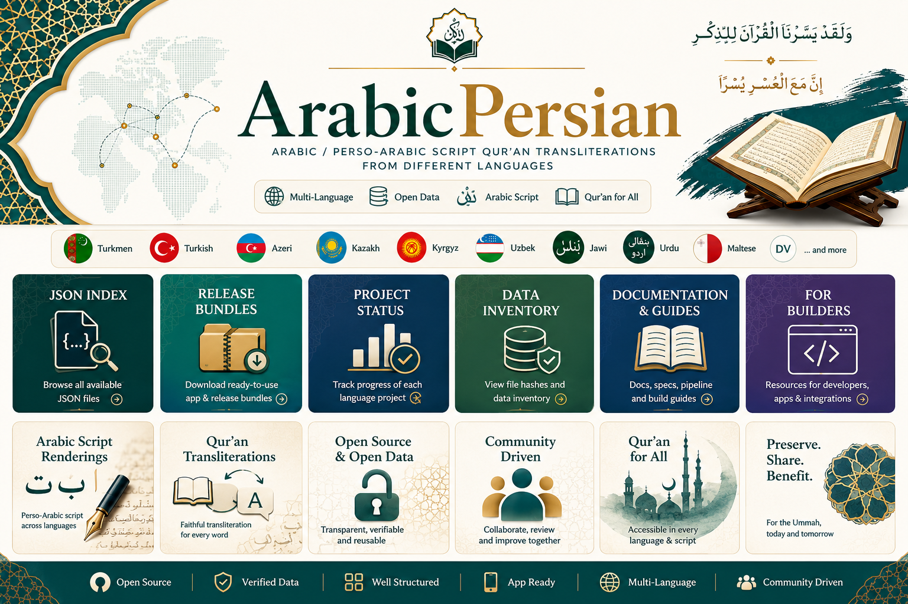
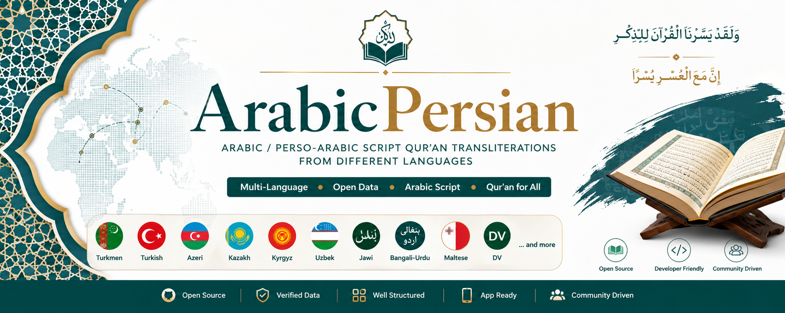

# ArabicPersian

A simple public index for Qur'an translation data and Arabic/Perso-Arabic script renderings across Turkic and related language projects.

This repository is meant to be easy to browse: choose a language, open the main file, and use the data in an app, reader, archive, or review workflow.

## Start Here

| Need | Best file |
|---|---|
| Turkmen Roman-script translation data | [Turkmen Roman JSON](data/source/turkmen/Turkmen_verse_only_corrected.json) / [CSV](data/source/turkmen/Turkmen_verse_only_corrected.csv) |
| Turkmen Afghan Perso-Arabic transliteration | [Turkmen Perso-Arabic JSON](data/releases/turkmen/Turkmen_PersoArabic_local.json) / [CSV](data/releases/turkmen/Turkmen_PersoArabic_local.csv) |
| Maltese Arabic/Perso-Arabic script rendering | [Maltese Arabic-script JSON](data/releases/maltese/maltese_quran_arabic_script.json) / [CSV](data/releases/maltese/maltese_quran_arabic_script.csv) |
| Browse by language | [Language index](docs/LANGUAGE_INDEX.md) |
| All available JSON files | [JSON index below](#json-index) |
| App/release bundles | [Release bundles below](#release-bundles) |
| Mid-pipeline datasets inside ZIPs | [Pipeline data index](docs/PIPELINE_DATA_INDEX.md) |
| Documentation hub | [Docs index](docs/README.md) |
| Project status | [Project status](docs/PROJECT_STATUS.md) |
| Data inventory with hashes | [Data inventory](docs/DATA_INVENTORY.json) |

## Languages

| Language | What is available | Open |
|---|---|---|
| Turkmen | Roman source plus Afghan Turkmen Perso-Arabic transliteration | [Roman JSON](data/source/turkmen/Turkmen_verse_only_corrected.json) / [Roman CSV](data/source/turkmen/Turkmen_verse_only_corrected.csv) / [Perso-Arabic JSON](data/releases/turkmen/Turkmen_PersoArabic_local.json) / [Perso-Arabic CSV](data/releases/turkmen/Turkmen_PersoArabic_local.csv) |
| Turkish | Arabic-script production candidate bundle | [Release ZIP](data/releases/turkish_quran_arabic_script_v4_0_consistency_usability.zip) |
| Azeri/Azerbaijani | Production v1 plus v2 Perso-Arabic starter | [Production v1 ZIP](data/releases/azeri_quran_arabic_script_production_v1.zip) / [v2 starter ZIP](data/releases/azeri/azeri_v2_perso_arabic_start.zip) |
| Kazakh | Production v1 plus app-final beta bundle | [Production v1 ZIP](data/releases/kazakh_quran_arabic_script_production_v1.zip) / [App-final ZIP](data/releases/kazakh/kazakh_app_final_bundle.zip) |
| Kyrgyz | QA production v1 beta bundle | [Release ZIP](data/releases/kyrgyz/kyrgyz_quran_arabic_script_v1_qa_production.zip) |
| Uzbek | v2 production fixed beta bundle | [Release ZIP](data/releases/uzbek/uzbek_quran_arabic_script_v2_production_fixed.zip) |
| Jawi | Source JSON input | [Source JSON](data/source/jawi/quranjawifinal.json) |
| Bangali-Urdu | Source JSON input | [Source JSON](data/source/bangali-urdu/bangaliurduquran.json) |
| Maltese | Source JSON plus Arabic/Perso-Arabic script rendering beta | [Source JSON](data/source/maltese/maltesequrandata.json) / [Arabic-script JSON](data/releases/maltese/maltese_quran_arabic_script.json) / [CSV](data/releases/maltese/maltese_quran_arabic_script.csv) |
| DV | Source JSON input | [Source JSON](data/source/dv/dv-unknow-simple.json) |

## JSON Index

- [Manifest](manifest.json)
- [Repository data inventory](docs/DATA_INVENTORY.json)
- [Future handoff project status](docs/handoff/project_status.json)
- [Turkmen corrected Roman-script source](data/source/turkmen/Turkmen_verse_only_corrected.json)
- [Turkmen Afghan Perso-Arabic transliteration](data/releases/turkmen/Turkmen_PersoArabic_local.json)
- [Turkmen transliteration QA failures](data/releases/turkmen/Turkmen_PersoArabic_local_qa_failures.json)
- [Turkmen source correction apply report](data/releases/turkmen/Turkmen_source_correction_apply_report.json)
- [Turkmen v2 merge report](data/releases/turkmen/Turkmen_v2_merge_report.json)
- [Turkmen project Brain](docs/turkmen/Brain.json)
- [Jawi source JSON](data/source/jawi/quranjawifinal.json)
- [Bangali-Urdu source JSON](data/source/bangali-urdu/bangaliurduquran.json)
- [Maltese source JSON](data/source/maltese/maltesequrandata.json)
- [Maltese Arabic/Perso-Arabic script rendering](data/releases/maltese/maltese_quran_arabic_script.json)
- [Maltese Arabic/Perso-Arabic script QA](data/releases/maltese/maltese_quran_arabic_script_qa.json)
- [DV source JSON](data/source/dv/dv-unknow-simple.json)

## Release Bundles

- [Turkish v4.0 consistency/usability bundle](data/releases/turkish_quran_arabic_script_v4_0_consistency_usability.zip)
- [Azeri production v1 bundle](data/releases/azeri_quran_arabic_script_production_v1.zip)
- [Azeri v2 Perso-Arabic starter bundle](data/releases/azeri/azeri_v2_perso_arabic_start.zip)
- [Kazakh production v1 bundle](data/releases/kazakh_quran_arabic_script_production_v1.zip)
- [Kazakh app-final beta bundle](data/releases/kazakh/kazakh_app_final_bundle.zip)
- [Kyrgyz QA production v1 beta bundle](data/releases/kyrgyz/kyrgyz_quran_arabic_script_v1_qa_production.zip)
- [Uzbek v2 production fixed beta bundle](data/releases/uzbek/uzbek_quran_arabic_script_v2_production_fixed.zip)

For the dictionaries, word-frequency files, morphology datasets, validation reports, search indexes, raw extracted sources, and other mid-pipeline files inside these ZIPs, see the [Pipeline Data Index](docs/PIPELINE_DATA_INDEX.md).

## Notes

These files are computational renderings, transliterations, or organized source datasets. Do not describe them as official or definitive scholarly editions unless they have been reviewed by qualified native and religious-text reviewers.

Before broad public redistribution, verify source permissions and attribution requirements.

Maltese Arabic/Perso-Arabic output is included as a beta script rendering and should receive native Maltese review before being called final.

## For Builders

- [Data layout](data/README.md)
- [Release data index](data/releases/README.md)
- [Intermediate pipeline index](data/intermediate/README.md)
- [Documentation hub](docs/README.md)
- [Language index](docs/LANGUAGE_INDEX.md)
- [Repository structure](docs/REPO_STRUCTURE.md)
- [Pipeline data index](docs/PIPELINE_DATA_INDEX.md)
- [App build guide](docs/APP_BUILD_GUIDE.md)
- [Universal app data spec](docs/handoff/APP_DATA_SPEC.md)
- [Pipeline summary](docs/handoff/PIPELINE_SUMMARY.md)
- [Next steps](docs/handoff/NEXT_STEPS.md)
- [License notes](docs/handoff/LICENSE_NOTES_GLOBAL.md)

